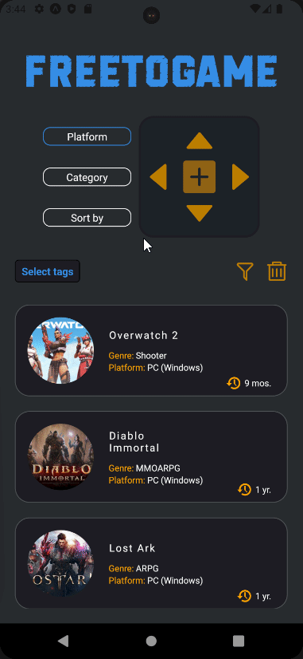

# FREETOGAME

## Properties and Features

The FreeToGame application boasts the following powerful properties and features:

1. **FreeToGame API Integration**: The application is integrated with the [FreeToGame API](https://www.freetogame.com/api-doc), allowing users to access a wide array of free-to-play games and related information.

2. **Multiple Filter Querying**: The application supports both single and multiple filter querying, enabling users to refine their search results and discover games that match multiple criteria simultaneously.

3. **Optimized HTTP Requests**: The `http.js` file includes a setting `requestCount = 4` to limit the number of requests, thereby improving the application's performance and response times.

## Setup

```
git clone https://github.com/Atakanz/freegame.git
cd freegame
npm install
npm start
```


