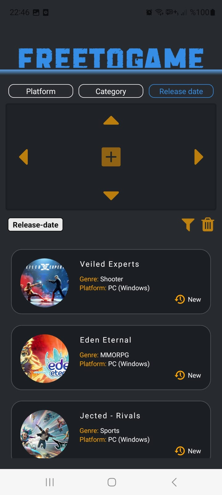

# FREETOGAME

## SETUP

```
git clone https://github.com/Atakanz/freegame.git
cd freegame
npm install
npm start
```

## API, PACKAGES, PROPERTIES

- [FreeToGame API](https://www.freetogame.com/api-doc)
- Fetching the full or filtered list
- Single (1) and multiple (2-3) filter querying
- You can switch filter headers with left and right arrows, different subtitles with up and down arrows
- Select subtitles with plus icon

<br>
<p float="left">



</p>
